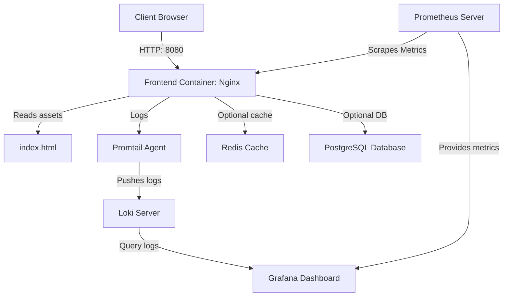

# Project Architecture Guide

This document describes the design architecture, directory structure, and integrations of the TrikiFun application.

---

## 1. Directory Structure

```
TrikiFun/
├── .gitleaks.toml           # Gitleaks security rules
├── .gitignore               # Ignored files standard configuration
├── ARCHITECTURE.md          # Project Architecture Guide
├── CHANGELOG.md             # Standard Changelog
├── DEPLOYMENT_GUIDE.md      # Deployment guidelines
├── Dockerfile               # Multi-stage production container configuration
├── README.md                # Project home page and setup instructions
├── docker-compose.yml       # Local orchestration docker configuration
├── eslint.config.js         # ESLint scanner properties
├── index.html               # Main frontend static HTML webpage
├── logo-top.png             # Application logo
├── package.json             # NPM package configurations
├── vercel.json              # Vercel configuration
├── k8s/                     # Kubernetes manifests
│   ├── configmap.yaml
│   ├── deployment.yaml
│   └── service.yaml
├── monitoring/              # Scraper configurations
│   ├── loki-config.yml
│   ├── promtail-config.yml
│   └── prometheus.yml
├── scripts/                 # DevOps automation pipelines scripts
│   ├── push-to-nexus.sh
│   ├── recovery.sh
│   └── run-security-checks.sh
├── terraform/               # Terraform IaC files
│   ├── main.tf
│   ├── outputs.tf
│   └── variables.tf
└── tests/                   # Jest verification tests
    └── app.test.js
```

---

## 2. Infrastructure Diagram


